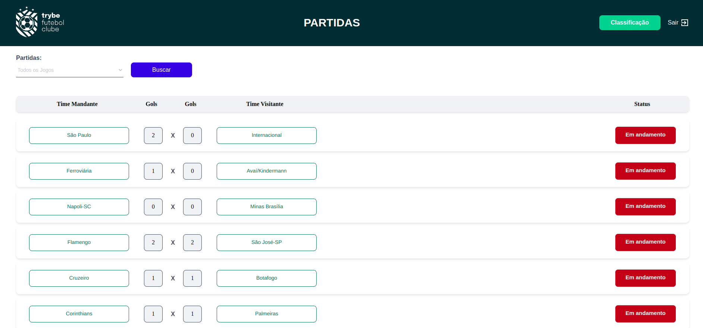
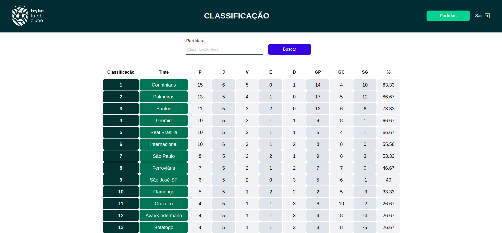

# Trybe Futebol Clube ⚽️ - Sequelize, TypeScript, Express, Docker, POO.
Esse projeto consistiu na criação de um back-end dockerizado, utilizando modelagem de dados através do Sequelize, para o TFC - um site informativo sobre partidas e classificações de futebol. O desenvolvimento da API foi construído com o intuito de ser consumido pelo front-end do projeto e popular adequadamente a tabela disponível que é exibida para a pessoa usuária no site.

## :hammer: Tecnologias Utilizadas
- Node.js
- Express
- Sequelize
- MySQL
- Docker

## :computer: Visualize este projeto:
Para executar o projeto, você deve ter o Docker instalado em sua máquina. Em seguida, siga os passos abaixo:
- Clone o repositório em sua máquina;
- Execute o comando `npm run install:apps` para instalar as dependências;
- Execute o comando `npm run compose:up` para subir os containers do projeto;
- O back-end estará disponível na porta 3001 e o front-end na porta 3000.

## :mag: Executando os testes:
Utilize o comando `npm test` na pasta `app/back-end`. Esse comando irá executar os testes de integração e  verificará se os comportamentos esperados estão sendo corretamente implementados na API. Para verificar a cobertura dos testes, utilize: `npm run test:coverage`.

## :bulb: Endpoints Disponíveis
- `GET /teams`: Retorna a lista de times cadastrados no banco de dados.
- `GET /teams/:id`: Retorna as informações de um time específico.
- `POST /login`: Efetua o login do usuário e gera um token.
- `GET /login/role`: Retorna o role do usuário logado.
- `GET /matches`: Retorna a lista de partidas cadastrados no banco de dados.
- `GET /matches?inProgress=`: Se true, retorna a lista de partidas em andamento no banco de dados, se false, as partidas finalizadas.
- `PATCH /matches/:id/finish`: Finalizar uma partida no banco de dados.
- `PATCH /matches/:id`: Atualizar o número de gols das partidas em andamento.
- `POST /matches`: Cadastra uma nova partida em andamento no banco de dados.
- `GET /leaderboard/home`: Retorne as informações do desempenho dos times da casa com as propriedades: name, totalPoints, totalGames, totalVictories, totalDraws, totalLosses, goalsFavor e goalsOwn.
- `GET /leaderboard/away`: Retorne as informações do desempenho dos times visitantes com as propriedades: name, totalPoints, totalGames, totalVictories, totalDraws, totalLosses, goalsFavor e goalsOwn.
- `GET /leaderboard/`:  Retorna a classificação geral dos times.

### Bibliotecas
A biblioteca utilizada para criptografar senhas no banco de dados é a `bcryptjs` npm e a biblioteca utilizada para a geração de tokens é a `JWT`.

